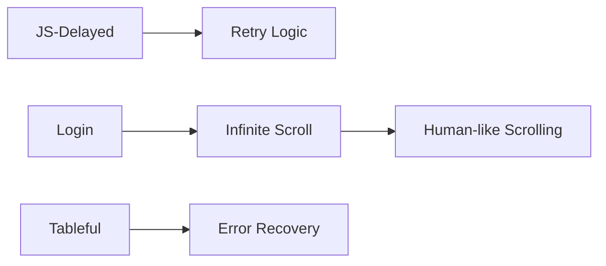

# 🧰 Scraper Implementation Timeline & Checklist

A practical timeline tailored to your learning path and scraper needs.

---

## 🚦 Recommended Implementation Phases

### ✅ Immediate Implementation (Core Learning Phase)

Start with these essentials:

```python
# Error Handling & Recovery
def scrape_with_retry(page, max_retries=3):
    # Your retry logic here
    pass

# Data Pipeline Integration
def save_data(quotes):
    # Basic JSON saving
    pass
```

**Why now?**  
These solve real issues with JS-delayed or timeout-prone endpoints. Retries stabilize, and JSON saving confirms your output.

---

### 🔁 Phase 2 (After Prototype Works)

Add once basic scraping works:

```python
# Stealth Configuration (basic)
def launch_stealth_browser(playwright):
    # Just user-agent rotation + window size
    pass

# Human-Like Interaction (light version)
def human_like_interaction(page):
    # Only random scrolling + 1 mouse movement
    pass
```

**Why next?**  
Helps avoid detection when scraping login pages or dynamic content. Keep it simple at first.

---

### 🚀 Phase 3 (Production Prep)

Upgrade when applying to real-world or freelance projects:

```python
# Performance Monitoring
# Proxy Rotation
# CAPTCHA handling
# Full behavioral patterns
```

**Why later?**  
These are enhancements for scale and stealth—unnecessary for beginner endpoints like `quotes.toscrape.com`.

---

## 🔍 Critical Hybrid Learning Alignment

Each feature matches a scraper problem:



**Apply the 70/30 Rule:**  
Implement only when a feature solves a **current** problem.

---

## ⚠️ Avoid Checklist Over-Engineering Now

**Skip** for:

- `Random` → Too simple
- `Default` → Static HTML

**Postpone advanced features:**

```python
# ❌ Not yet:
page.mouse.wheel(0, randint(300,800))  # Complex interactions
psutil.Process().memory_info().rss      # Performance optimization
# AI-Powered Bypasses                 # Overkill for training
```

---

## 📆 Suggested Timeline Summary

| Phase | Features                                | When to Apply                          |
|-------|------------------------------------------|----------------------------------------|
| 1     | Retry logic, JSON saving                | When scraping dynamic JS or errors     |
| 2     | Stealth config, simple human behavior   | When sites block or detect you         |
| 3     | Proxies, CAPTCHA, performance logging   | When scaling or freelancing            |

---

## 🎯 Key Principle

> "Implement features ONLY when the **problem demands it**."

This ensures your scraper grows with your skill while solving real-world scraping challenges.

